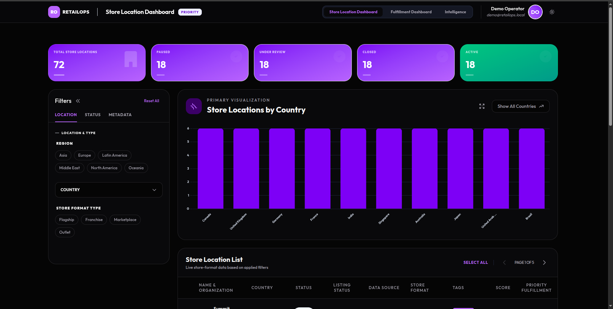
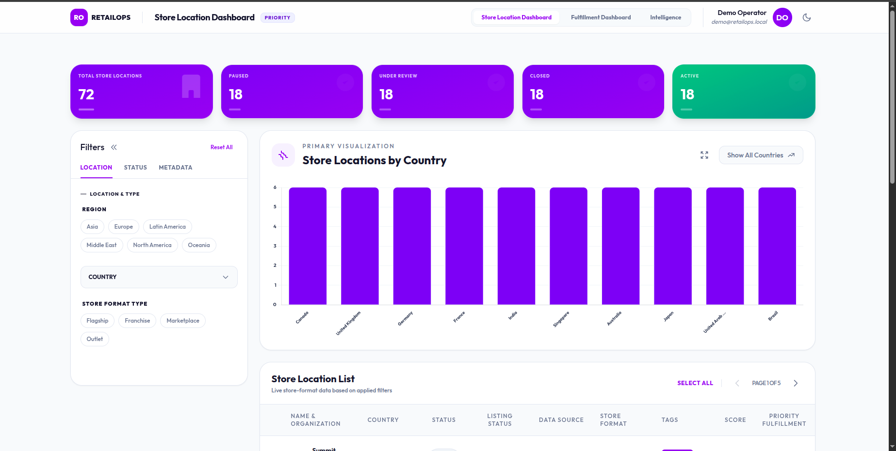
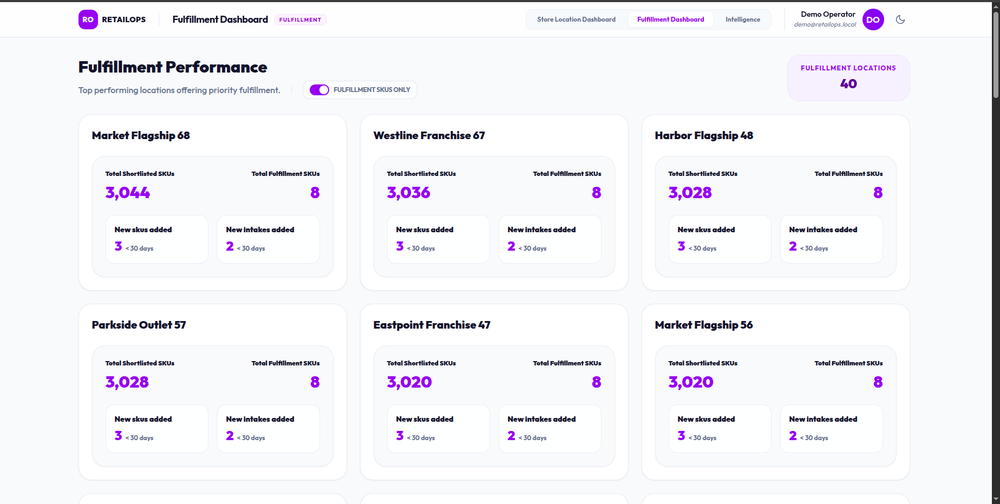
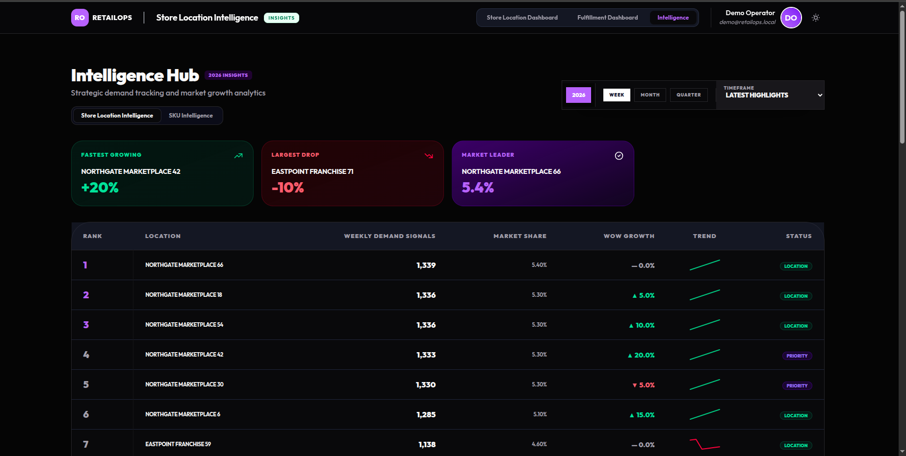

# PulseOps — Retail Operations Intelligence Dashboard

> Enterprise-grade retail analytics dashboard built with TypeScript and Express using deterministic generated data for safe public showcasing.

PulseOps is a self-contained retail operations dashboard designed to demonstrate backend API architecture, dashboard UX, analytics aggregation, filtering systems, chart-driven insights, fulfillment workflows, and deployment readiness — without exposing workplace systems or proprietary data.

---

# Dashboard Preview

## Dark Mode



## Light Mode



## Fulfillment Analytics



## Demand Intelligence



---

# Features

* Retail operations analytics dashboard
* Advanced filtering and sorting
* Pagination for large datasets
* KPI and chart aggregation APIs
* Fulfillment intelligence workflows
* Demand analytics for locations and SKUs
* Deterministic mock-data engine
* Dark and light theme support
* Dockerized development environment
* Vercel deployment support
* Jest-based service and API testing
* Fully sanitized public demo architecture

---

# Tech Stack

## Backend

* Node.js
* Express
* TypeScript

## Frontend

* Tailwind CSS
* Chart.js

## Testing & Tooling

* Jest
* Docker
* Docker Compose
* Vercel Serverless Adapter

---

# What This Project Demonstrates

This project was designed to showcase practical dashboard engineering skills including:

* API architecture design
* Analytics aggregation patterns
* Table filtering and pagination systems
* Dashboard state management
* Mock data simulation
* Fulfillment and operations workflows
* Deployment packaging
* Dockerized development
* Frontend/backend integration
* Production-style project structuring

---

# Local Development

Install dependencies:

```bash
npm install
```

Start development server:

```bash
npm run dev
```

Open:

```text
http://localhost:7778
```

The dashboard runs entirely in demo mode with generated in-memory data.

No database, authentication provider, cache layer, or external services are required.

---

# Environment Configuration

Optional `.env` values:

```bash
NODE_ENV=development
PORT=7778
AUTH_MODE=disabled
LOG_LEVEL=info
```

Keep:

```bash
AUTH_MODE=disabled
```

for the public portfolio version.

---

# Available Scripts

```bash
npm run dev
npm run build
npm start
npm test
```

## Build

```bash
npm run build
```

Compiles TypeScript into:

```text
dist/
```

## Start Production Build

```bash
npm start
```

---

# Docker Setup

Run locally using Docker:

```bash
docker compose up --build
```

Open:

```text
http://localhost:7778
```

The Docker environment runs only sanitized generated demo data.

---

# Vercel Deployment

Included:

* `vercel.json`
* `api/index.ts`

Recommended configuration:

```text
Build Command: npm run build
Install Command: npm install
Output Directory: public
```

No environment variables are required for the public demo deployment.

---

# Public API

## Retail Dashboard

```text
GET /api/retail/locations
GET /api/retail/locations/charts
```

## Fulfillment Analytics

```text
GET /api/retail/fulfillment/summary
GET /api/retail/fulfillment/location/:locationId
```

## Demand Intelligence

```text
GET /api/retail/demand/weeks
GET /api/retail/demand/query
GET /api/retail/demand/categories
GET /api/retail/demand/trend/:locationName
```

## Health Check

```text
GET /health
```

---

# Demo Dataset

The application generates deterministic retail demo data at runtime including:

* 72 retail store locations
* Regional and country segmentation
* Store lifecycle statuses
* Multi-format retail operations
* Fulfillment metrics
* SKU leaderboards
* Demand trend analytics
* Category-based performance insights

The generated dataset is deterministic to ensure:

* repeatable demos
* stable screenshots
* predictable testing
* reproducible analytics

---

# Testing

Run test suite:

```bash
npm test
```

Coverage includes:

* Filtering systems
* Sorting behavior
* Pagination logic
* Chart aggregation
* Demand analytics services
* Fulfillment summaries
* Response structures

---

# Portfolio Positioning

PulseOps is a sanitized portfolio project inspired by enterprise retail analytics systems.

It demonstrates:

* scalable dashboard architecture
* analytics-focused API design
* operational intelligence workflows
* deployment readiness
* testing strategy
* modern dashboard engineering patterns

without exposing any internal workplace infrastructure or proprietary business data.

---

# Privacy & Sanitization

This repository intentionally excludes:

* workplace databases
* company data
* production credentials
* OAuth configuration
* Firebase
* MongoDB
* Redis
* internal branding
* secrets
* infrastructure references

Before publishing, verify:

```bash
rg "company-name|internal|secret|firebase|mongo|redis|oauth|client_secret|private_key|password|token" .
```

Never commit:

* `.env`
* production secrets
* API credentials
* workplace configuration
* internal assets

---

# Suggested GitHub Repository Description

```text
Enterprise-grade retail operations dashboard showcasing analytics APIs, filtering systems, chart aggregation, fulfillment workflows, Docker packaging, and Vercel deployment using deterministic generated data.
```
